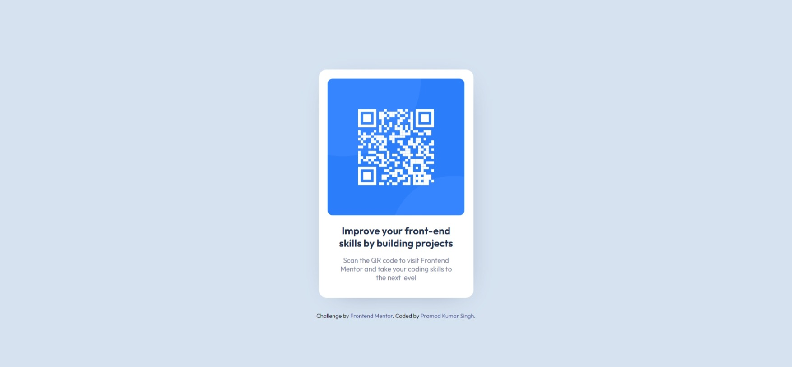

# Frontend Mentor - QR code component solution

This is a solution to the [QR code component challenge on Frontend Mentor](https://www.frontendmentor.io/challenges/qr-code-component-iux_sIO_H). Frontend Mentor challenges help you improve your coding skills by building realistic projects. 

## Table of contents

- [Overview](#overview)
  - [Screenshot](#screenshot)
  - [Links](#links)
- [My process](#my-process)
  - [Built with](#built-with)
  - [What I learned](#what-i-learned)
- [Author](#author)

**Note: Delete this note and update the table of contents based on what sections you keep.**

## Overview

### Screenshot

### Links

- Solution URL: [GitHub](https://github.com/PramodSinghPKS/frontendmentor-challenges-solutions/tree/main/qr-code-component)
- Live Site URL: [QR Code Component](https://fmio-qr-code-component.vercel.app/)

## My process

### Built with

- HTML and CSS
- CSS custom properties
- CSS Grid

### What I learned

This challenge helped in practicing the HTML and CSS skills by building project.

## Author

- Github - [Pramod Kumar Singh](https://github.com/PramodSinghPKS)
- Frontend Mentor - [@PramodSinghPKS](https://www.frontendmentor.io/profile/PramodSinghPKS)
- Twitter - [@pramodsingh_pks](https://www.twitter.com/pramodsingh_pks)
